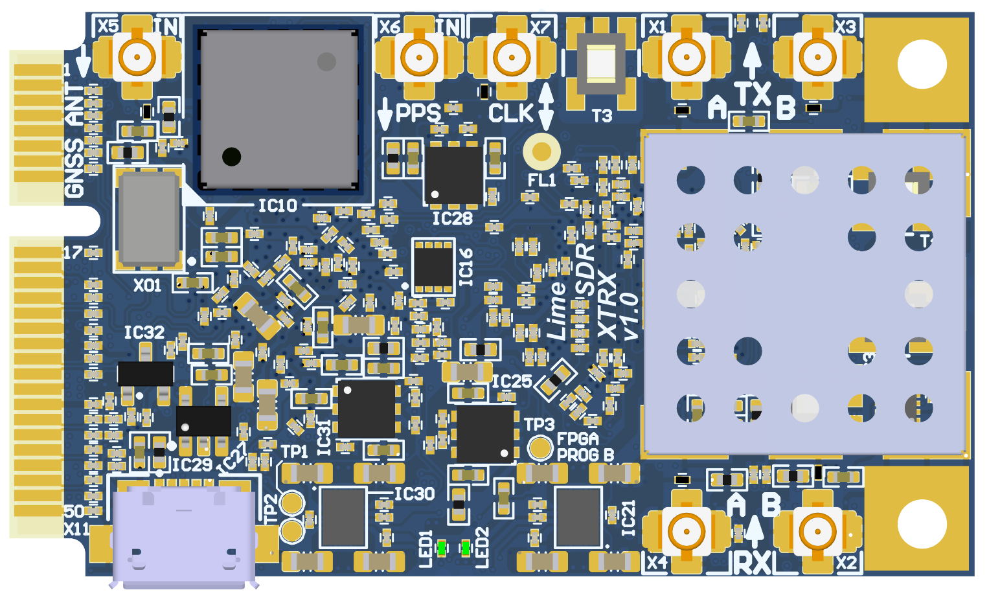
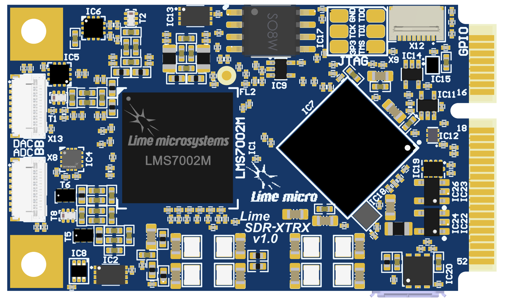
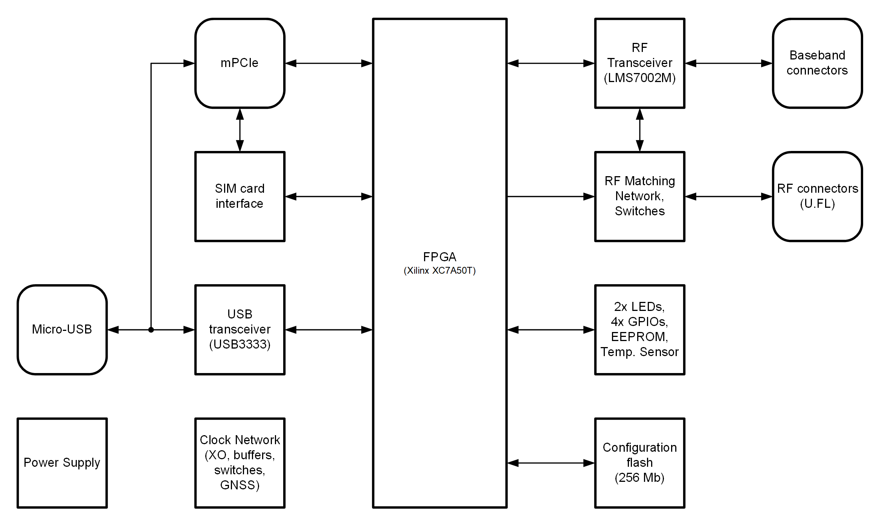
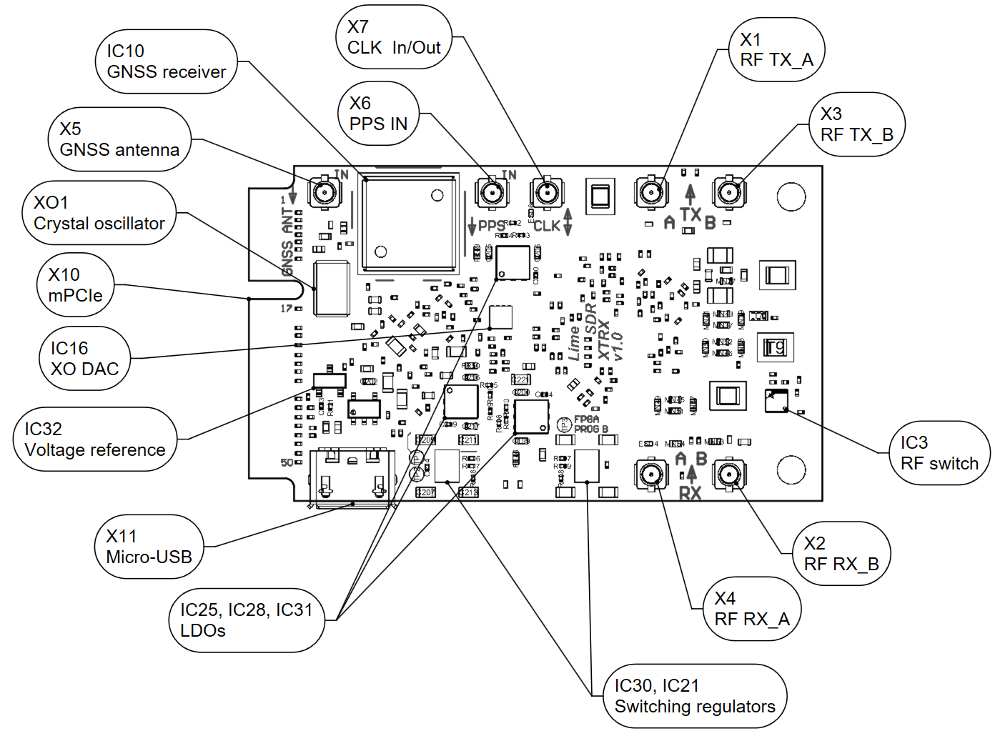
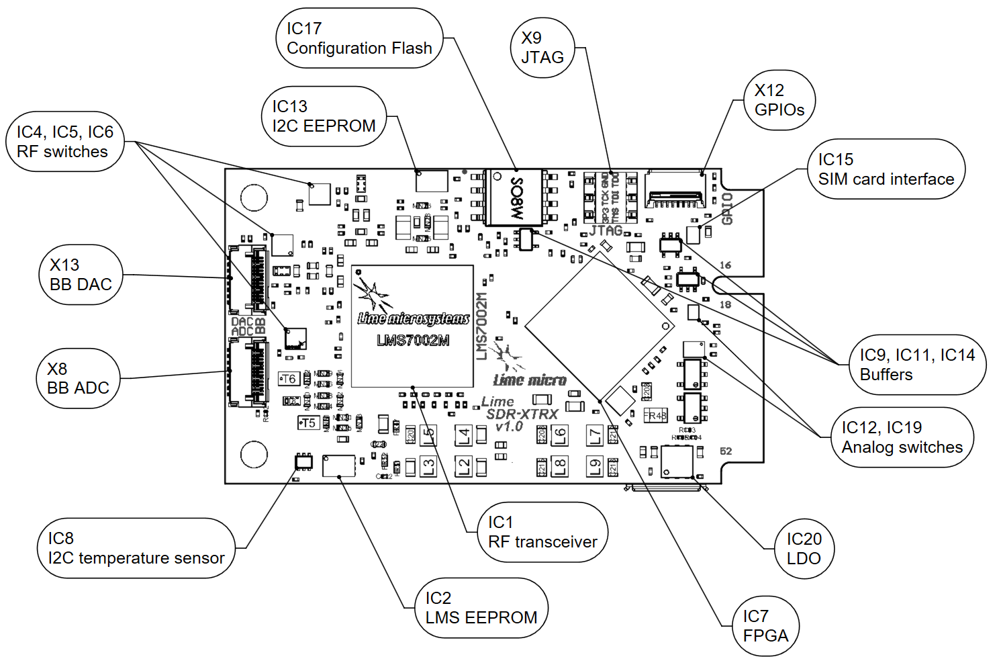

.. toctree::
   :maxdepth: 3
   :hidden:

   Introduction <self>
   documentation/board-description

Introduction
============

LimeSDR XTRX Board Key Features
-------------------------------

LimeSDR XTRX is Small form factor mini PCIe expansion card Software Defined Radio (SDR) board. It provides a hardware platform for developing and prototyping high-performance and logic-intensive digital and RF designs based on Xilinx’s XC7A50T-2CPG236I FPGA and Lime Microsystems transceiver chipsets.

LimeSDR XTRX is a building block for any Massive MIMO configuration from 2Tx2R to 32Tx32R for very high data rate applications. Hence, it could be used in conjunction with any digital processors (ASICs, GPPs and GPUs) of varying level of performance in terms of speed, power dissipation and cost to fit any air interface from narrowband to broadband signals. The board is  designed for maximum scalability in terms of the following parameters:

* Frequency and Bandwidth: The heard of the board is the Lime Transceiver RFIC (LMS7002) providing frequency flexibility up to 3.8GHz and bandwidths of over 100MHz.
* Baseband Interface: A significant level of digital circuitry resides within the LMS7002 and accompanying Xilinx for the implementation of the key physical layer radio functions including filtering, decimation, interpolation and flexible interface such as PCIe and SerDes to name a few.

  
  Figure 1: LimeSDR XTRX v1.0 board top view

  
  Figure 2: LimeSDR XTRX v1.0 board bottom view

LimeSDR XTRX board features:

* RF and BB parameters:

  * Configuration: MIMO (2xTX, 2xRX)
  * Frequency range: 30 MHz – 3.8 GHz
  * Bandwidth: 30.72 MHz
  * Sample depth: 12 bit
  * Sample rate: 30.72 MSPS
  * Transmit power: max 10 dBm (depending on frequency)

* USB 2.0 controller: Microchip USB3333E-GL

* FPGA: board is designed based on Xilinx Artix-7 XC7A50T-2CPG236I FPGAs in 236-ball CSBGA package. Xilinx XC7A50T-2CPG236I features are:

  * 236-pin CSBGA package (10mm x 10mm, 0.5mm)
  * 52160 LUTs logic capacity
  * 2700 Kb Embedded Memory
  * 600 Kb distributed RAM
  * 120x 18x18-bit multipliers
  * 5x PLLs and 4x DLLs
  * 106 IOs
  * FPGA configuration via JTAG

* RF transceiver: Lime Microsystems LMS7002M

* EEPROM Memory: 128Kb EEPROM for LMS MCU firmware (optional); 128Kb EEPROM for FPGA data (optional)

* FLASH Memory: 256Mb Flash memory for FPGA configuration

* Temperature sensor: TMP1075NDRLR

* General user inputs/outputs:

  * 2x Green LEDs
  * 4x GPIOs 3.3V in GPIO connector
  * 1x GPIO in Baseband connectors

* Connections:

  * USB 2.0 (Micro-B) socket
  * Coaxial RF (U.FL female) connectors
  * FPGA GPIO 8-pin FPC connector
  * FPGA JTAG connector (unpopulated)
  * Mini PCIe edge connector
  * RF Baseband 15-pin FPC connectors

* Clock system:

  * 26.00MHz (or 30.72MHz) on board VCTCXO
  * VCTCXO may be tuned by on board DAC
  * Reference clock input and output connector (U.FL)

* Board size: 50.8mm x 20.97mm (PCIe Mini card form factor)

* Board power sources: USB connector (5V) or mini PCIe (3.3V)

For more information on the following topics, refer to the respective documents:

* `Microchip USB3333E-GL USB 2.0 transceiver datasheet <https://ww1.microchip.com/downloads/aemDocuments/documents/OTH/ProductDocuments/DataSheets/00001880A.pdf>`_
* `Xilinx Artix-7 XC7A50T-2CPG236I data sheet <https://docs.xilinx.com/v/u/en-US/ds181_Artix_7_Data_Sheet>`_
* `Lime Microsystems LMS7002M transceiver resources <https://limemicro.com/technology/lms7002m/>`_

Board Overview
-------------- 

One of the key elements of LimeSDR XTRX board is the Xilinx Artix-7 (XC7A50T-2CPG236I) FPGA. It’s main function is to transfer digital data between LMS7002M RF transceiver and PC through a mini PCIe edge connector or Serial connection to another FPGA board. The block diagram for LimeSDR XTRX board is presented in the Figure 3.

  
  Figure 3: LimeSDR XTRX v1.0 board block diagram

This section contains component location description on the board. LimeSDR XTRX board picture with highlighted connectors and main components are presented in Figure 4 and Figure 5, respectively. 

  
  Figure 4: LimeSDR XTRX v1.0 board top connectors and main components

.. _target1:

  
  Figure 5: LimeSDR XTRX v1.0 board bottom connectors and main components

Description of board components is given in the Table 1.

.. table:: Table 1. Board components

  +----------------------------------------------+-----------------------+--------------------------------------------------------------------------------+
  | **Featured Devices**                         |                       |                                                                                |
  +==============================================+=======================+================================================================================+
  | **Board Reference**                          | **Type**              | **Description**                                                                |
  +----------------------------------------------+-----------------------+--------------------------------------------------------------------------------+
  | IC1                                          | RF transceiver        | Lime Microsystems LMS7002M                                                     |
  +----------------------------------------------+-----------------------+--------------------------------------------------------------------------------+
  | IC7                                          | FPGA                  | Xilinx Artix-7(XC7A50T-2CPG236I)                                               |
  +----------------------------------------------+-----------------------+--------------------------------------------------------------------------------+
  | IC18                                         | USB 3.0               | Microchip USB 2.0 to transceiver chip USB3333E-GL                              |
  |                                              |                       |                                                                                |
  |                                              | microcontroller       |                                                                                |
  +----------------------------------------------+-----------------------+--------------------------------------------------------------------------------+
  | **Miscellaneous devices**                    |                       |                                                                                |
  +----------------------------------------------+-----------------------+--------------------------------------------------------------------------------+
  | IC8                                          | IC                    | Temperature sensor TMP1075NDRLR                                                |
  +----------------------------------------------+-----------------------+--------------------------------------------------------------------------------+
  | IC15                                         | IC                    | SIM Card Interface NVT4555UKZ                                                  |
  +----------------------------------------------+-----------------------+--------------------------------------------------------------------------------+
  | **Configuration, Status and Setup Elements** |                       |                                                                                |
  +----------------------------------------------+-----------------------+--------------------------------------------------------------------------------+
  | X9                                           | JTAG chain            | FPGA programming connector on the PCB bottom side                              |
  |                                              |                       |                                                                                |
  |                                              | connector             | (compatible with Molex 788641001 connector)                                    |
  +----------------------------------------------+-----------------------+--------------------------------------------------------------------------------+
  | LED1, LED2                                   | Red-green status LEDs | User defined FPGA indication LED.                                              |
  +----------------------------------------------+-----------------------+--------------------------------------------------------------------------------+
  | **General User Input/Output**                |                       |                                                                                |
  +----------------------------------------------+-----------------------+--------------------------------------------------------------------------------+
  | X12                                          | Pin header            | 8-pin FPC connector                                                            |
  +----------------------------------------------+-----------------------+--------------------------------------------------------------------------------+
  | **Memory Devices**                           |                       |                                                                                |
  +----------------------------------------------+-----------------------+--------------------------------------------------------------------------------+
  | IC2                                          | IC                    | I²C EEPROM Memory 128Kb (16 x 8), connected to LMS7002M RF transceiver I2C bus |
  +----------------------------------------------+-----------------------+--------------------------------------------------------------------------------+
  | IC13                                         | IC                    | I²C EEPROM Memory 128Kb (16K x 8), connected to FPGA I2C bus                   |
  +----------------------------------------------+-----------------------+--------------------------------------------------------------------------------+
  | IC17                                         | IC                    | SPI Flash Memory 256 Mb (32M x 8) connected to FPGA SPI                        |
  +----------------------------------------------+-----------------------+--------------------------------------------------------------------------------+
  | **Communication Ports**                      |                       |                                                                                |
  +----------------------------------------------+-----------------------+--------------------------------------------------------------------------------+
  | X11                                          | USB 2.0               | USB 2.0 Micro-B socket                                                         |
  +----------------------------------------------+-----------------------+--------------------------------------------------------------------------------+
  | X10                                          | mini PCIe             | mini PCI Express Card Edge connector                                           |
  +----------------------------------------------+-----------------------+--------------------------------------------------------------------------------+
  | **Clock Circuitry**                          |                       |                                                                                |
  +----------------------------------------------+-----------------------+--------------------------------------------------------------------------------+
  | XO1                                          | VCTCXO                | 26.00 MHz Voltage Controlled Temperature Compensated Crystal Oscillator        |
  +----------------------------------------------+-----------------------+--------------------------------------------------------------------------------+
  | IC16                                         | IC                    | 16 bit DAC for VCTCXO (XO1) frequency tuning (default)                         |
  +----------------------------------------------+-----------------------+--------------------------------------------------------------------------------+
  | IC10                                         | IC                    | GNSS Receiver module                                                           |
  +----------------------------------------------+-----------------------+--------------------------------------------------------------------------------+
  | IC9, IC11, IC14                              | IC                    | Buffer                                                                         |
  +----------------------------------------------+-----------------------+--------------------------------------------------------------------------------+
  | IC12                                         | IC                    | Analogue switch                                                                |
  +----------------------------------------------+-----------------------+--------------------------------------------------------------------------------+
  | IC19                                         | IC                    | Analogue switch                                                                |
  +----------------------------------------------+-----------------------+--------------------------------------------------------------------------------+
  | X7                                           | U.FL connector        | Reference clock input/output (CLK)                                             |
  +----------------------------------------------+-----------------------+--------------------------------------------------------------------------------+
  | X6                                           | U.FL connector        | 1PPS input                                                                     |
  +----------------------------------------------+-----------------------+--------------------------------------------------------------------------------+
  | X5                                           | U.FL connector        | GNSS (active) antenna connector                                                |
  +----------------------------------------------+-----------------------+--------------------------------------------------------------------------------+
  | **Power Supply**                             |                       |                                                                                |
  +----------------------------------------------+-----------------------+--------------------------------------------------------------------------------+
  | IC21                                         | IC                    | Four-output switching regulator LP8758A1E0YFFR                                 |
  +----------------------------------------------+-----------------------+--------------------------------------------------------------------------------+
  | IC30                                         | IC                    | Four-output switching regulator LP8758A1E0YFFR                                 |
  +----------------------------------------------+-----------------------+--------------------------------------------------------------------------------+
  | IC20                                         | IC                    | Linear regulator LD39100PUR                                                    |
  +----------------------------------------------+-----------------------+--------------------------------------------------------------------------------+
  | IC25                                         | IC                    | Linear regulator LD39100PUR                                                    |
  +----------------------------------------------+-----------------------+--------------------------------------------------------------------------------+
  | IC28                                         | IC                    | Linear regulator LD39100PUR                                                    |
  +----------------------------------------------+-----------------------+--------------------------------------------------------------------------------+
  | IC31                                         | IC                    | Linear regulator LD39100PUR                                                    |
  +----------------------------------------------+-----------------------+--------------------------------------------------------------------------------+
