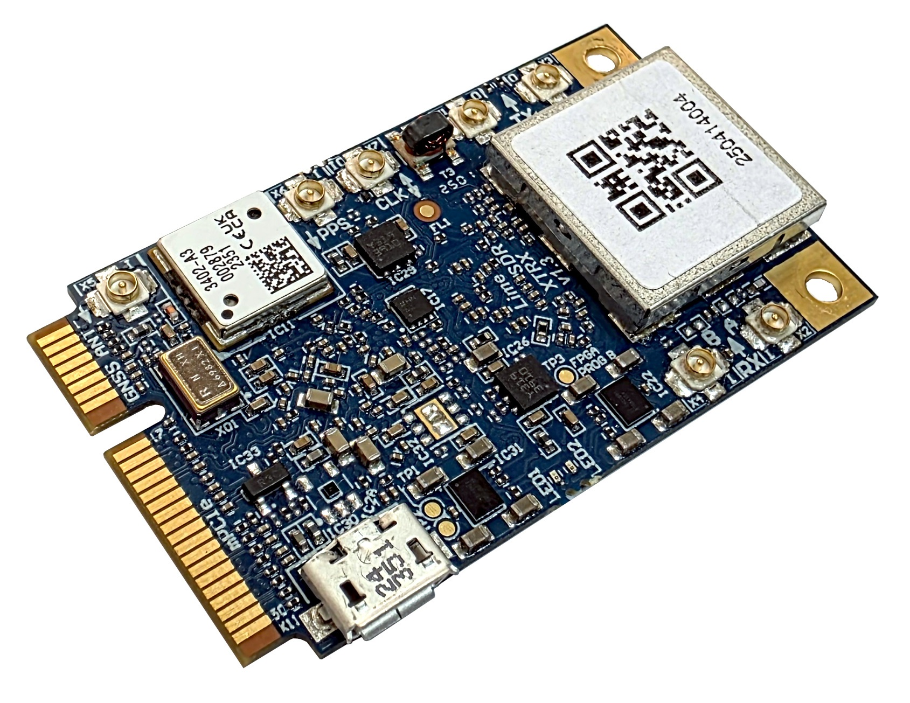

Introduction
############

.. toctree::
   :maxdepth: 3
   :hidden:
   
   Introduction <self>
   user/index
   reference/index
   developer

LimeSDR XTRX is a Mini PCIe expansion card software-defined radio (SDR), with a 2T2R MIMO capability and covering a frequency range from 30 MHz to 3.8 GHz, with up to 120 MHz bandwidth. It additionally may be used as a building block for Massive MIMO configurations, where multiple boards are employed and utilise a common frequency reference, for very high data rate applications.

The eminently compact LimeSDR XTRX provides a hardware platform for developing high-performance, logic-intensive digital and RF designs based on a Xilinx Artix-7 series FPGA and Lime Microsystems transceiver chipsets. It may be used in conjunction with digital baseband processors — GPPs, GPUs and ASICs — of varying level of performance in terms of speed, power dissipation and cost, to fit any air interface and application.

LimeSDR XTRX FPGA gateware builds on the open source LiteX framework, which makes it much easier to integrate custom functionality, such as hardware accelerated physical layer processing. The default gateware also integrates the Lime PPS Disciplined Oscillator (LimePPSDO) functionality, which can be used to enable precision frequency synchronisation via either the onboard GNSS module or an external 1PPS reference.  

A significant level of digital circuitry resides within the LMS7002M field-programmable RF (FPRF) transceiver and accompanying Xilinx Artix-7 FPGA, enabling the implementation of key physical layer radio functions, including filtering, decimation and interpolation, together with flexible interfaces such as PCIe and SerDes, to name but a few.

Specifications
**************

RF
==

.. list-table:: 
   :header-rows: 1
   :stub-columns: 1

   * - Parameter
     - Value
     - Notes
   * - Configuration
     - MIMO (2T2R)
     - 2 Full-duplex channels
   * - Frequency Range
     - 30 MHz – 3.8 GHz
     - Non-continuous coverage
   * - Bandwidth
     - up to 120 MHz
     - Software configurable
   * - Sample depth
     - 12 bit
     - 
   * - Sample rate
     - 30.72 MSPS
     - 
   * - LO Leakage
     - <-40 dBc
     - After calibration
   * - Max. Safe Rx Input Power
     - 10 dBm
     - Absolute maximum
   * - Rx Gain Range
     - 89 dB
     - LNA + TIA + PGA combined

Digital Interface
=================

Mini PCIe edge connector with PCIe Gen 2 x2.

.. note::
   A custom baseboard or adapter is required to use both PCIe lanes. 
   
   Single lane operation results in slightly reduced performance.

Power Supply
============

.. list-table:: 
   :header-rows: 1
   :stub-columns: 1

   * - Parameter
     - Value
     - Notes
   * - Input Voltage (mPCIe)
     - 3.3 V DC
     - Via mPCIe connector
   * - Input Voltage (USB)
     - 5 V DC
     - Via Micro-B USB connector
   * - Maximum Power (mPCIe)
     - 3.3 W
     - mPCIe limit

.. note::
   Power consumption depends on configuration.

.. warning::
   Incorrect voltage or inadequate current capacity may cause damage or unstable operation.

Environmental
=============

.. list-table:: 
   :header-rows: 1
   :stub-columns: 1

   * - Parameter
     - Value
     - Notes
   * - Operating Temperature
     - -40 °C to +85 °C
     - Industrial-grade
   * - Storage Temperature
     - -40 °C to +85 °C
     - N/A
   * - Operating Humidity
     - 10% to 90% RH  
     - Non-condensing

.. note::
   USB micro connector (X11) operating temperature range -30 °C to +85 °C.

Mechanical
==========

Mini PCIe (full size) form factor, 50.8 × 20.97 mm, <15g weight.

Features
********

Devices
=======

* RF transceiver: Lime Microsystems LMS7002M
* FPGA: Xilinx Artix-7 (XC7A50T-2CPG236I)

  * 236-pin CSBGA package (10mm x 10mm, 0.5mm)
  * 52160 LUTs logic capacity
  * 2700 Kb Embedded Memory
  * 600 Kb distributed RAM
  * 120x 18x18-bit multipliers
  * 5x PLLs and 4x DLLs
  * FPGA configuration via JTAG

* USB 2.0 controller: Microchip USB3333E-GL
* Temperature sensor: TMP1075NDRLR

Clock system
============

* 26.00MHz on board VCTCXO
* VCTCXO may be tuned by GPSDO function or external PPS reference
* Reference clock input and output connectors (U.FL and mPCIe)
* 1PPS input (U.FL and mPCIe) and output (mPCIe) 

.. Note::
   Single U.FL connector (X7) is used for both reference clock input and output.

Memory
======

* 128Kb EEPROM for LMS MCU firmware (optional)
* 128Kb EEPROM for FPGA data (optional)
* 256Mb Flash memory for FPGA configuration

General user inputs/outputs:
============================

* 2x Green LEDs
* 4x GPIOs 3.3V in GPIO connector
* 1x GPIO in baseband connectors

Connections
===========

* Mini PCIe edge connector
* USB 2.0 (Micro-B) socket
* Coaxial RF and clock (U.FL female) connectors
* FPGA GPIO 8-pin FPC connector
* FPGA JTAG connector
* RF baseband 15-pin FPC connectors

Purchasing
**********

Please see the  `Lime Micro website`_ for purchasing options.

Regulatory
**********

RoHS
====

This product is RoHS compliant and does not contain hazardous substances as defined by Directive 2011/65/EU.

WEEE
====

This product must be disposed of properly according to local regulations. Do not dispose of with general household waste.

RF Transmission Notice
======================

.. warning::
   Operating RF transmitting equipment may require appropriate licensing. Users are responsible for ensuring compliance with local regulations. Unauthorised transmission may result in legal penalties.

.. _Lime Micro Website: https://limemicro.com/sdr/limesdr-xtrx/
