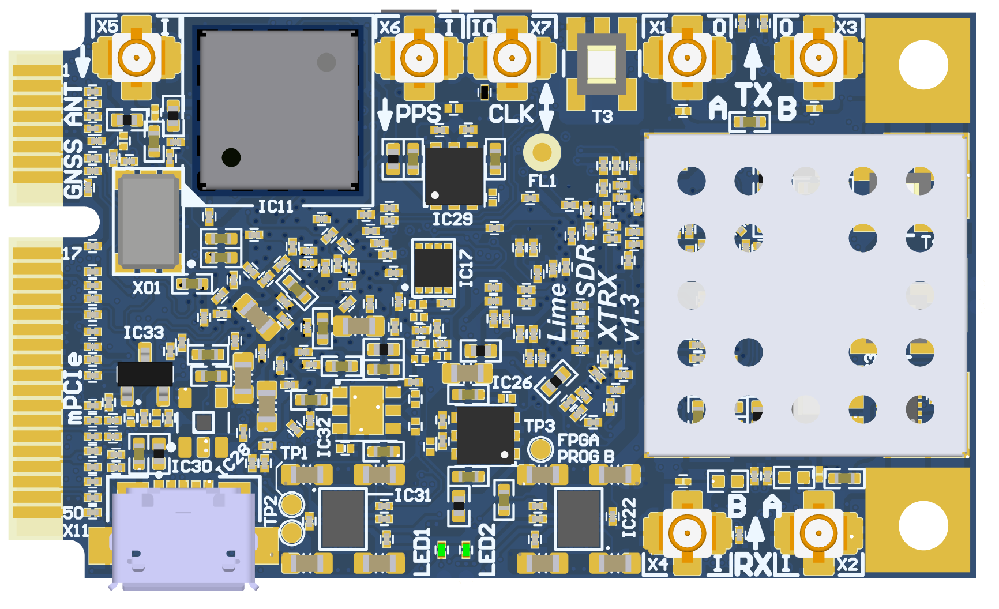
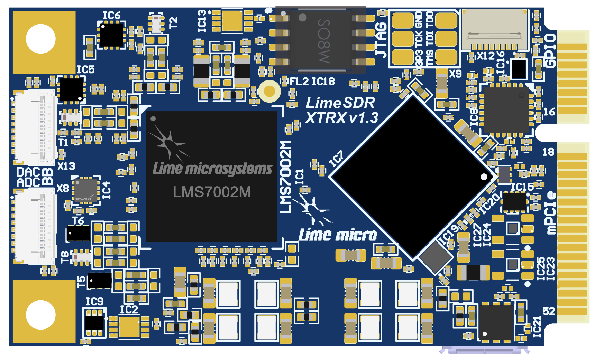
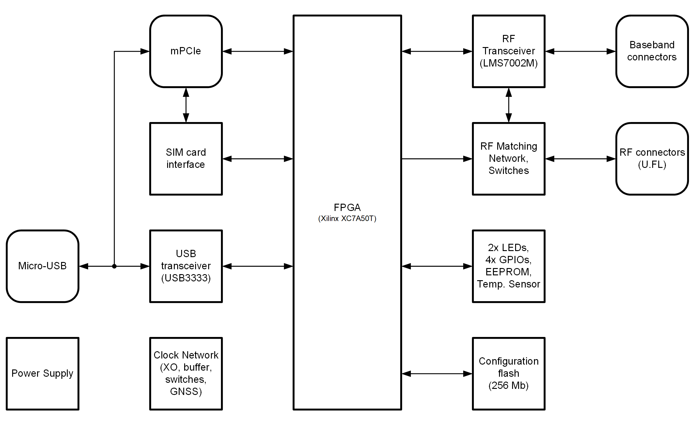
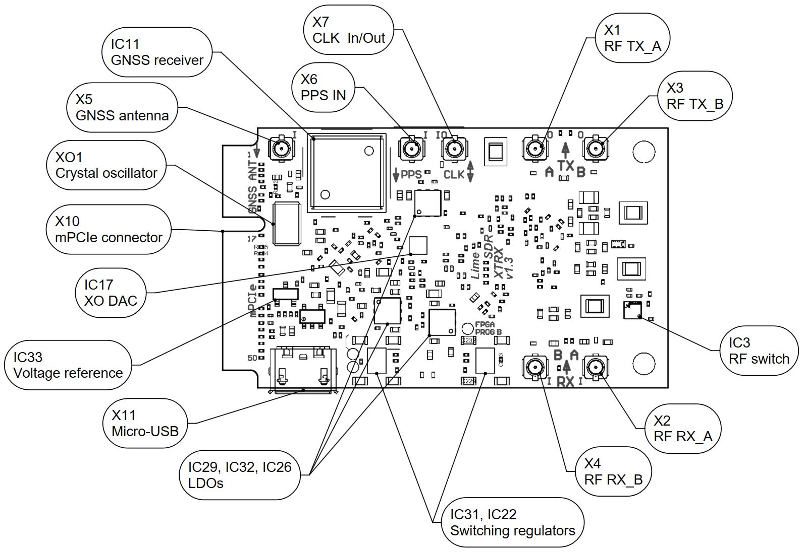
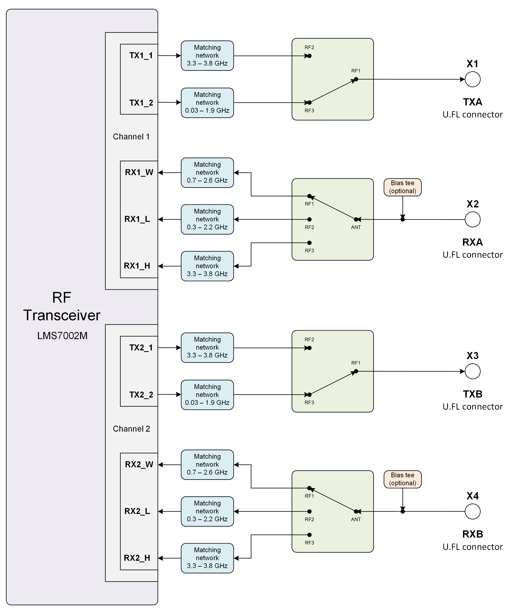

***********************
LimeSDR XTRX v1.3 Board
***********************

Introduction
============

LimeSDR XTRX v1.3 Board Key Features
------------------------------------

LimeSDR XTRX is Small form factor mini PCIe expansion card Software Defined Radio (SDR) board. It provides a hardware platform for developing and prototyping high-performance and logic-intensive digital and RF designs based on Xilinx’s XC7A50T-2CPG236I FPGA and Lime Microsystems transceiver chipsets.

LimeSDR XTRX is a building block for any Massive MIMO configuration from 2Tx2R to 32Tx32R for very high data rate applications. Hence, it could be used in conjunction with any digital processors (ASICs, GPPs and GPUs) of varying level of performance in terms of speed, power dissipation and cost to fit any air interface from narrowband to broadband signals. The board is designed for maximum scalability in terms of the following parameters:

* Frequency and Bandwidth: The heard of the board is the Lime Transceiver RFIC (LMS7002) providing frequency flexibility up to 3.8GHz and bandwidths of over 100MHz.
* Baseband Interface: A significant level of digital circuitry resides within the LMS7002 and accompanying Xilinx for the implementation of the key physical layer radio functions including filtering, decimation, interpolation and flexible interface such as PCIe and SerDes to name a few.

  
  Figure 1: LimeSDR XTRX v1.3 board top view

  
  Figure 2: LimeSDR XTRX v1.3 board bottom view

LimeSDR XTRX board features:

* RF and BB parameters:

  * Configuration: MIMO (2xTX, 2xRX)
  * Frequency range: 30 MHz – 3.8 GHz
  * Bandwidth: 30.72 MHz
  * Sample depth: 12 bit
  * Sample rate: 30.72 MSPS
  * Transmit power: max 10 dBm (depending on frequency)

* USB 2.0 controller: Microchip USB3333E-GL

* FPGA: board is designed based on Xilinx Artix-7 XC7A50T-2CPG236I FPGAs in 236-ball CSBGA package. Xilinx XC7A50T-2CPG236I features are:

  * 236-pin CSBGA package (10mm x 10mm, 0.5mm)
  * 52160 LUTs logic capacity
  * 2700 Kb Embedded Memory
  * 600 Kb distributed RAM
  * 120x 18x18-bit multipliers
  * 5x PLLs and 4x DLLs
  * 106 IOs
  * FPGA configuration via JTAG

* RF transceiver: Lime Microsystems LMS7002M

* EEPROM Memory: 128Kb EEPROM for LMS MCU firmware (optional); 128Kb EEPROM for FPGA data (optional)

* FLASH Memory: 256Mb Flash memory for FPGA configuration

* Temperature sensor: TMP1075NDRLR

* General user inputs/outputs:

  * 2x Green LEDs
  * 4x GPIOs 3.3V in GPIO connector
  * 1x GPIO in Baseband connectors

* Connections:

  * USB 2.0 (Micro-B) socket
  * Coaxial RF (U.FL female) connectors
  * FPGA GPIO 8-pin FPC connector
  * FPGA JTAG connector (unpopulated)
  * Mini PCIe edge connector
  * RF Baseband 15-pin FPC connectors

* Clock system:

  * 26.00MHz on board VCTCXO
  * VCTCXO may be tuned by on board DAC
  * Reference clock input and output connectors (U.FL and mPCIe)

* Board size: 50.8mm x 20.97mm (PCIe Mini card form factor)

* Board power sources: USB connector (5V) or mini PCIe (3.3V)

For more information on the following topics, refer to the respective documents:

* `Microchip USB3333E-GL USB 2.0 transceiver datasheet <https://ww1.microchip.com/downloads/aemDocuments/documents/OTH/ProductDocuments/DataSheets/00001880A.pdf>`_
* `Xilinx Artix-7 XC7A50T-2CPG236I data sheet <https://docs.xilinx.com/v/u/en-US/ds181_Artix_7_Data_Sheet>`_
* `Lime Microsystems LMS7002M transceiver resources <https://limemicro.com/technology/lms7002m/>`_

Board Overview
-------------- 

One of the key elements of LimeSDR XTRX board is the Xilinx Artix-7 (XC7A50T-2CPG236I) FPGA. It’s main function is to transfer digital data between LMS7002M RF transceiver and PC through a mini PCIe edge connector or Serial connection to another FPGA board. The block diagram for LimeSDR XTRX board is presented in the Figure 3.

  
  Figure 3: LimeSDR XTRX v1.3 board block diagram

This section contains component location description on the board. LimeSDR XTRX board picture with highlighted connectors and main components are presented in Figure 4 and Figure 5, respectively. 

  
  Figure 4: LimeSDR XTRX v1.3 board top connectors and main components

.. _target1:

.. figure:: images/LimeSDR-XTRX_v1.3_components_bot.png
  :width: 600
  
  Figure 5: LimeSDR XTRX v1.3 board bottom connectors and main components

Description of board components is given in the Table 1.

.. table:: Table 1. Board components

  +----------------------------------------------+-----------------------+--------------------------------------------------------------------------------+
  | **Featured Devices**                         |                       |                                                                                |
  +==============================================+=======================+================================================================================+
  | **Board Reference**                          | **Type**              | **Description**                                                                |
  +----------------------------------------------+-----------------------+--------------------------------------------------------------------------------+
  | IC1                                          | RF transceiver        | Lime Microsystems LMS7002M                                                     |
  +----------------------------------------------+-----------------------+--------------------------------------------------------------------------------+
  | IC7                                          | FPGA                  | Xilinx Artix-7(XC7A50T-2CPG236I)                                               |
  +----------------------------------------------+-----------------------+--------------------------------------------------------------------------------+
  | IC19                                         | USB 3.0               | Microchip USB 2.0 to transceiver chip USB3333E-GL                              |
  |                                              |                       |                                                                                |
  |                                              | microcontroller       |                                                                                |
  +----------------------------------------------+-----------------------+--------------------------------------------------------------------------------+
  | **Miscellaneous devices**                    |                       |                                                                                |
  +----------------------------------------------+-----------------------+--------------------------------------------------------------------------------+
  | IC9                                          | IC                    | Temperature sensor TMP1075NDRLR                                                |
  +----------------------------------------------+-----------------------+--------------------------------------------------------------------------------+
  | IC16                                         | IC                    | SIM Card Interface NVT4555UKZ                                                  |
  +----------------------------------------------+-----------------------+--------------------------------------------------------------------------------+
  | **Configuration, Status and Setup Elements** |                       |                                                                                |
  +----------------------------------------------+-----------------------+--------------------------------------------------------------------------------+
  | X9                                           | JTAG chain            | FPGA programming connector on the PCB bottom side                              |
  |                                              |                       |                                                                                |
  |                                              | connector             | (compatible with Molex 788641001 connector)                                    |
  +----------------------------------------------+-----------------------+--------------------------------------------------------------------------------+
  | LED1, LED2                                   | Status LEDs           | User defined FPGA indication LEDs                                              |
  +----------------------------------------------+-----------------------+--------------------------------------------------------------------------------+
  | **General User Input/Output**                |                       |                                                                                |
  +----------------------------------------------+-----------------------+--------------------------------------------------------------------------------+
  | X12                                          | Pin header            | 8-pin FPC connector                                                            |
  +----------------------------------------------+-----------------------+--------------------------------------------------------------------------------+
  | **Memory Devices**                           |                       |                                                                                |
  +----------------------------------------------+-----------------------+--------------------------------------------------------------------------------+
  | IC2                                          | IC                    | I²C EEPROM Memory 128Kb (16 x 8), connected to LMS7002M RF transceiver I2C bus |
  +----------------------------------------------+-----------------------+--------------------------------------------------------------------------------+
  | IC13                                         | IC                    | I²C EEPROM Memory 128Kb (16K x 8), connected to FPGA I2C bus                   |
  +----------------------------------------------+-----------------------+--------------------------------------------------------------------------------+
  | IC18                                         | IC                    | SPI Flash Memory 256 Mb (32M x 8) connected to FPGA SPI                        |
  +----------------------------------------------+-----------------------+--------------------------------------------------------------------------------+
  | **Communication Ports**                      |                       |                                                                                |
  +----------------------------------------------+-----------------------+--------------------------------------------------------------------------------+
  | X11                                          | USB 2.0               | USB 2.0 Micro-B socket                                                         |
  +----------------------------------------------+-----------------------+--------------------------------------------------------------------------------+
  | X10                                          | mini PCIe             | mini PCI Express Card Edge connector                                           |
  +----------------------------------------------+-----------------------+--------------------------------------------------------------------------------+
  | **Clock Circuitry**                          |                       |                                                                                |
  +----------------------------------------------+-----------------------+--------------------------------------------------------------------------------+
  | XO1                                          | VCTCXO                | 26.00 MHz Voltage Controlled Temperature Compensated Crystal Oscillator        |
  +----------------------------------------------+-----------------------+--------------------------------------------------------------------------------+
  | IC17                                         | IC                    | 16 bit DAC for VCTCXO (XO1) frequency tuning (default)                         |
  +----------------------------------------------+-----------------------+--------------------------------------------------------------------------------+
  | IC11                                         | IC                    | GNSS Receiver module                                                           |
  +----------------------------------------------+-----------------------+--------------------------------------------------------------------------------+
  | IC8                                          | IC                    | Clock buffer LMK00105                                                          |
  +----------------------------------------------+-----------------------+--------------------------------------------------------------------------------+
  | IC15                                         | IC                    | Analogue switch                                                                |
  +----------------------------------------------+-----------------------+--------------------------------------------------------------------------------+
  | IC20                                         | IC                    | Analogue switch                                                                |
  +----------------------------------------------+-----------------------+--------------------------------------------------------------------------------+
  | X7                                           | U.FL connector        | Reference clock input/output (CLK)                                             |
  +----------------------------------------------+-----------------------+--------------------------------------------------------------------------------+
  | X6                                           | U.FL connector        | 1PPS input                                                                     |
  +----------------------------------------------+-----------------------+--------------------------------------------------------------------------------+
  | X5                                           | U.FL connector        | GNSS (active) antenna connector                                                |
  +----------------------------------------------+-----------------------+--------------------------------------------------------------------------------+
  | **Power Supply**                             |                       |                                                                                |
  +----------------------------------------------+-----------------------+--------------------------------------------------------------------------------+
  | IC22                                         | IC                    | Four-output switching regulator LP8758A1E0YFFR                                 |
  +----------------------------------------------+-----------------------+--------------------------------------------------------------------------------+
  | IC31                                         | IC                    | Four-output switching regulator LP8758A1E0YFFR                                 |
  +----------------------------------------------+-----------------------+--------------------------------------------------------------------------------+
  | IC21                                         | IC                    | Linear regulator LD39100PUR                                                    |
  +----------------------------------------------+-----------------------+--------------------------------------------------------------------------------+
  | IC26                                         | IC                    | Linear regulator LD39100PUR                                                    |
  +----------------------------------------------+-----------------------+--------------------------------------------------------------------------------+
  | IC29                                         | IC                    | Linear regulator LD39100PUR                                                    |
  +----------------------------------------------+-----------------------+--------------------------------------------------------------------------------+
  | IC32                                         | IC                    | Linear regulator LD39100PUR                                                    |
  +----------------------------------------------+-----------------------+--------------------------------------------------------------------------------+

LimeSDR XTRX Board Architecture
===============================

More detailed description of LimeSDR XTRX board components and interconnections is given in the following sections of this chapter.

LMS7002M RF transceiver digital connectivity
--------------------------------------------

The interface and control signals are described below:

* Digital Interface Signals: LMS7002 is using data bus LMS_DIQ1_D[11:0] and LMS_DIQ2_D[11:0], LMS_EN_IQSEL1 and LMS_EN_IQSEL2, LMS_FCLK1 and LMS_FCLK2, LMS_MCLK1 and LMS_MCLK2 signals to transfer data to/from the XILINX FPGA. Indices 1 and 2 indicate transceiver digital data PORT-1 or PORT-2. Any of these ports can be used to transmit or receive digital IQ data. By default PORT-1 is selected as transmitter port and PORT-2 is selected as receiver port. The FCLK# is input clock and MCLK# is output clock for the LMS7002M transceiver. TXNRX signals are used to indicate ports direction. Please refer to LMS7002M transceiver datasheet page 12-13. [link] for the LMS7002M interface timing.
* LMS Control Signals: these signals are used for the following functions within the LMS7002 RFIC:
  * LMS_RXEN, LMS_TXEN – receiver and transmitter enable/disable signals connected to FPGA Bank 14 (3.3V).
  * LMS_RESET – LMS7002M reset is connected to FPGA Bank 14 (3.3V).
* SPI Interface: LMS7002M transceiver is configured via 4-wire SPI interface: FPGA_SPI_SCLK, FPGA_SPI_MOSI, FPGA_SPI_MISO, FPGA_SPI_LMS_SS. The SPI interface is connected to FPGA Bank 14 (3.3V).
* LMS I2C Interface: can be used for LMS EEPROM content modification or debug purposes. The signals LMS_I2C_SCL and LMS_I2C_DATA are connected to EEPROM.

.. table:: Table 2. LMS7002M RF transceiver digital interface pins

  +--------------------+--------------------------+---------------------------+--------------+-----------------------+-------------------------------------------+
  | **Chip pin (IC1)** | **Chip reference (IC1)** | **Schematic signal name** | **FPGA pin** | **FPGA I/O standard** | **Description**                           |
  +====================+==========================+===========================+==============+=======================+===========================================+
  | E5                 | xoscin_tx                | LMS_TxPLL_CLK             |              |                       | Connected to reference clock              |
  +--------------------+--------------------------+---------------------------+--------------+-----------------------+-------------------------------------------+
  | AB34               | MCLK1                    | LMS_MCLK1                 | L17          | 3.3V                  |                                           |
  +--------------------+--------------------------+---------------------------+--------------+-----------------------+-------------------------------------------+
  | AA33               | FCLK1                    | LMS_FCLK1                 | G19          | 3.3V                  |                                           |
  +--------------------+--------------------------+---------------------------+--------------+-----------------------+-------------------------------------------+
  | V32                | TXNRX1                   | LMS_TXNRX1                | V15          | 3.3V                  |                                           |
  +--------------------+--------------------------+---------------------------+--------------+-----------------------+-------------------------------------------+
  | U29                | TXEN                     | LMS_TXEN                  | W19          | 3.3V                  |                                           |
  +--------------------+--------------------------+---------------------------+--------------+-----------------------+-------------------------------------------+
  | Y32                | ENABLE_IQSEL1            | LMS_EN_IQSEL1             | P19          | 3.3V                  |                                           |
  +--------------------+--------------------------+---------------------------+--------------+-----------------------+-------------------------------------------+
  | AG31               | DIQ1_D0                  | LMS_DIQ1_D0               | J17          | 3.3V                  |                                           |
  +--------------------+--------------------------+---------------------------+--------------+-----------------------+-------------------------------------------+
  | AF30               | DIQ1_D1                  | LMS_DIQ1_D1               | H17          | 3.3V                  |                                           |
  +--------------------+--------------------------+---------------------------+--------------+-----------------------+-------------------------------------------+
  | AF34               | DIQ1_D2                  | LMS_DIQ1_D2               | H19          | 3.3V                  |                                           |
  +--------------------+--------------------------+---------------------------+--------------+-----------------------+-------------------------------------------+
  | AE31               | DIQ1_D3                  | LMS_DIQ1_D3               | K17          | 3.3V                  |                                           |
  +--------------------+--------------------------+---------------------------+--------------+-----------------------+-------------------------------------------+
  | AD30               | DIQ1_D4                  | LMS_DIQ1_D4               | G17          | 3.3V                  |                                           |
  +--------------------+--------------------------+---------------------------+--------------+-----------------------+-------------------------------------------+
  | AC29               | DIQ1_D5                  | LMS_DIQ1_D5               | V16          | 3.3V                  |                                           |
  +--------------------+--------------------------+---------------------------+--------------+-----------------------+-------------------------------------------+
  | AE33               | DIQ1_D6                  | LMS_DIQ1_D6               | J19          | 3.3V                  |                                           |
  +--------------------+--------------------------+---------------------------+--------------+-----------------------+-------------------------------------------+
  | AD32               | DIQ1_D7                  | LMS_DIQ1_D7               | M19          | 3.3V                  |                                           |
  +--------------------+--------------------------+---------------------------+--------------+-----------------------+-------------------------------------------+
  | AC31               | DIQ1_D8                  | LMS_DIQ1_D8               | P17          | 3.3V                  |                                           |
  +--------------------+--------------------------+---------------------------+--------------+-----------------------+-------------------------------------------+
  | AC33               | DIQ1_D9                  | LMS_DIQ1_D9               | N19          | 3.3V                  |                                           |
  +--------------------+--------------------------+---------------------------+--------------+-----------------------+-------------------------------------------+
  | AB30               | DIQ1_D10                 | LMS_DIQ1_D10              | U17          | 3.3V                  |                                           |
  +--------------------+--------------------------+---------------------------+--------------+-----------------------+-------------------------------------------+
  | AB32               | DIQ1_D11                 | LMS_DIQ1_D11              | U16          | 3.3V                  |                                           |
  +--------------------+--------------------------+---------------------------+--------------+-----------------------+-------------------------------------------+
  | AM24               | xoscin_rx                | LMS_RxPLL_CLK             |              |                       | Connected to reference clock              |
  +--------------------+--------------------------+---------------------------+--------------+-----------------------+-------------------------------------------+
  | P34                | MCLK2                    | LMS_MCLK2                 | W5           | 3.3V                  |                                           |
  +--------------------+--------------------------+---------------------------+--------------+-----------------------+-------------------------------------------+
  | R29                | FCLK2                    | LMS_FCLK2                 | W6           | 3.3V                  |                                           |
  +--------------------+--------------------------+---------------------------+--------------+-----------------------+-------------------------------------------+
  | U31                | TXNRX2                   | LMS_TXNRX2                | U5           | 3.3V                  |                                           |
  +--------------------+--------------------------+---------------------------+--------------+-----------------------+-------------------------------------------+
  | V34                | RXEN                     | LMS_RXEN                  | W18          | 3.3V                  |                                           |
  +--------------------+--------------------------+---------------------------+--------------+-----------------------+-------------------------------------------+
  | R33                | ENABLE_IQSEL2            | LMS_EN_IQSEL2             | W7           | 3.3V                  |                                           |
  +--------------------+--------------------------+---------------------------+--------------+-----------------------+-------------------------------------------+
  | H30                | DIQ2_D0                  | LMS_DIQ2_D0               | W2           | 3.3V                  |                                           |
  +--------------------+--------------------------+---------------------------+--------------+-----------------------+-------------------------------------------+
  | J31                | DIQ2_D1                  | LMS_DIQ2_D1               | U2           | 3.3V                  |                                           |
  +--------------------+--------------------------+---------------------------+--------------+-----------------------+-------------------------------------------+
  | K30                | DIQ2_D2                  | LMS_DIQ2_D2               | U3           | 3.3V                  |                                           |
  +--------------------+--------------------------+---------------------------+--------------+-----------------------+-------------------------------------------+
  | K32                | DIQ2_D3                  | LMS_DIQ2_D3               | V3           | 3.3V                  |                                           |
  +--------------------+--------------------------+---------------------------+--------------+-----------------------+-------------------------------------------+
  | L31                | DIQ2_D4                  | LMS_DIQ2_D4               | V4           | 3.3V                  |                                           |
  +--------------------+--------------------------+---------------------------+--------------+-----------------------+-------------------------------------------+
  | K34                | DIQ2_D5                  | LMS_DIQ2_D5               | V2           | 3.3V                  |                                           |
  +--------------------+--------------------------+---------------------------+--------------+-----------------------+-------------------------------------------+
  | M30                | DIQ2_D6                  | LMS_DIQ2_D6               | V5           | 3.3V                  |                                           |
  +--------------------+--------------------------+---------------------------+--------------+-----------------------+-------------------------------------------+
  | M32                | DIQ2_D7                  | LMS_DIQ2_D7               | V4           | 3.3V                  |                                           |
  +--------------------+--------------------------+---------------------------+--------------+-----------------------+-------------------------------------------+
  | N31                | DIQ2_D8                  | LMS_DIQ2_D8               | V8           | 3.3V                  |                                           |
  +--------------------+--------------------------+---------------------------+--------------+-----------------------+-------------------------------------------+
  | N33                | DIQ2_D9                  | LMS_DIQ2_D9               | U4           | 3.3V                  |                                           |
  +--------------------+--------------------------+---------------------------+--------------+-----------------------+-------------------------------------------+
  | P30                | DIQ2_D10                 | LMS_DIQ2_D10              | U8           | 3.3V                  |                                           |
  +--------------------+--------------------------+---------------------------+--------------+-----------------------+-------------------------------------------+
  | P32                | DIQ2_D11                 | LMS_DIQ2_D11              | U7           | 3.3V                  |                                           |
  +--------------------+--------------------------+---------------------------+--------------+-----------------------+-------------------------------------------+
  | U33                | CORE_LDO_EN              | LMS_CORE_LDO_EN           | W17          | 3.3V                  |                                           |
  +--------------------+--------------------------+---------------------------+--------------+-----------------------+-------------------------------------------+
  | E27                | RESET                    | LMS_RESET                 | U19          | 3.3V                  |                                           |
  +--------------------+--------------------------+---------------------------+--------------+-----------------------+-------------------------------------------+
  | D28                | SEN                      | FPGA_SPI_LMS_SS           | W13          | 3.3V                  | SPI interface                             |
  +--------------------+--------------------------+---------------------------+--------------+-----------------------+-------------------------------------------+
  | C29                | SCLK                     | FPGA_SPI_SCLK             | W14          | 3.3V                  | SPI interface                             |
  +--------------------+--------------------------+---------------------------+--------------+-----------------------+-------------------------------------------+
  | F30                | SDIO                     | FPGA_SPI_MOSI             | W16          | 3.3V                  | SPI interface                             |
  +--------------------+--------------------------+---------------------------+--------------+-----------------------+-------------------------------------------+
  | F28                | SDO                      | FPGA_SPI_MISO             | W15          | 3.3V                  | SPI interface                             |
  +--------------------+--------------------------+---------------------------+--------------+-----------------------+-------------------------------------------+
  | D26                | SDA                      | LMS_I2C_SDA               |              |                       | Connected to EEPROM                       |
  +--------------------+--------------------------+---------------------------+--------------+-----------------------+-------------------------------------------+
  | C27                | SCL                      | LMS_I2C_SCL               |              |                       | Connected to EEPROM                       |
  +--------------------+--------------------------+---------------------------+--------------+-----------------------+-------------------------------------------+

RF network control signals
--------------------------

LimeSDR XTRX RF network contains matching networks, RF switches, loopback variable attenuator and U.FL connectors (X1, X3 - TX and X2, X4 - RX) as shown in Figure 6.

  
  Figure 6. LimeSDR XTRX v1.3 RF diagram

LMS7002M RF transceiver TX and RX ports has dedicated matching network which determines the working frequency range. More detailed information on LMS7002M RF transceiver ports and matching network frequency ranges is listed in the Table 3.

.. table:: Table 3. LMS7002M RF transceiver ports and matching networks frequency ranges

  +--------------------------------------+-------------------------------+
  | **LMS7002M** **RF transceiver port** | **Frequency range**           |
  +======================================+===============================+
  | TX1_1, TX2_1                         | 2 GHz - 2.6 GHz               |
  +--------------------------------------+-------------------------------+
  | TX1_2, TX2_2                         | 30 MHz - 1.9 GHz              |
  +--------------------------------------+-------------------------------+
  | RX1_H, RX2_H                         | 2 GHz - 2.6 GHz               |
  +--------------------------------------+-------------------------------+
  | RX1_W, RX2_W                         | 700 MHz - 900 MHz             |
  +--------------------------------------+-------------------------------+
  | RX1_L, RX2_L                         | 300 MHz – 2.2 GHz             |
  +--------------------------------------+-------------------------------+

RF network switches are controlled via 2.4V logic signals. This is achieved by resistor dividers connected between FPGA (TX_SW, RX_SW1, RX_SW2) and switch control pin (TX_SW_DIV, RX_SW1_DIV, RX_SW2_DIV). RF network control signals are described in the Table 4.

.. table:: Table 4. RF network control signals

  +-----------------------------+---------------------------+------------------+--------------+-----------------------------------------------------------+
  | **Component**               | **Schematic signal name** | **I/O standard** | **FPGA pin** | **Description**                                           |
  +=============================+===========================+==================+==============+===========================================================+
  | SKY13330-397LF(IC5 and IC6) | TX_SW/TX_SW_DIV           | 3.3V             | P1           | FPGA 3.3V logic level signal divided to 2.4V logic level. |
  +-----------------------------+---------------------------+------------------+--------------+-----------------------------------------------------------+
  | SKY13414-485LF(IC3 and IC4) | RX_SW1/RX_SW1_DIV         | 3.3V             | K3           | FPGA 3.3V logic level signal divided to 2.4V logic level. |
  +-----------------------------+---------------------------+------------------+--------------+-----------------------------------------------------------+
  |                             | RX_SW2/RX_SW2_DIV         | 3.3V             | J3           | FPGA 3.3V logic level signal divided to 2.4V logic level. |
  +-----------------------------+---------------------------+------------------+--------------+-----------------------------------------------------------+

LMS7002M baseband connectors
----------------------------

LMS7002M RF transceiver (IC1)) baseband signals (RX ADC and TX DAC) can be accessed via 0.3mm pitch 15 pin FPC connectors (X13 and X8). RX DAC connector pinout is shown in Table 5. TX ADC connector pinout is shown in Table 6.

.. table:: Table 5. LMS7002 base band TX DAC connector (X13)

  +---------+---------------------------+---------------------------------------------------+
  | **Pin** | **Schematic signal name** | **Description**                                   |
  +=========+===========================+===================================================+
  | 1       | GND                       | Ground                                            |
  +---------+---------------------------+---------------------------------------------------+
  | 2       | DAC1Q_P                   | Channel 1 quadrature signal differential positive |
  +---------+---------------------------+---------------------------------------------------+
  | 3       | DAC1Q_N                   | Channel 1 quadrature signal differential negative |
  +---------+---------------------------+---------------------------------------------------+
  | 4       | GND                       | Ground                                            |
  +---------+---------------------------+---------------------------------------------------+
  | 5       | DAC1I_P                   | Channel 1 in-phase signal differential positive   |
  +---------+---------------------------+---------------------------------------------------+
  | 6       | DAC1I_N                   | Channel 1 in-phase signal differential negative   |
  +---------+---------------------------+---------------------------------------------------+
  | 7       | GND                       | Ground                                            |
  +---------+---------------------------+---------------------------------------------------+
  | 8       | GPIO13                    | General purpose input/output (FPGA pin T17)       |
  +---------+---------------------------+---------------------------------------------------+
  | 9       | GND                       | Ground                                            |
  +---------+---------------------------+---------------------------------------------------+
  | 10      | DAC2Q_P                   | Channel 2 quadrature signal differential positive |
  +---------+---------------------------+---------------------------------------------------+
  | 11      | DAC2Q_N                   | Channel 2 quadrature signal differential negative |
  +---------+---------------------------+---------------------------------------------------+
  | 12      | GND                       | Ground                                            |
  +---------+---------------------------+---------------------------------------------------+
  | 13      | DAC2I_P                   | Channel 2 in-phase signal differential positive   |
  +---------+---------------------------+---------------------------------------------------+
  | 14      | DAC2I_N                   | Channel 2 in-phase signal differential negative   |
  +---------+---------------------------+---------------------------------------------------+
  | 15      | GND                       | Ground                                            |
  +---------+---------------------------+---------------------------------------------------+

.. table:: Table 6. LMS7002 base band RX ADC connector (X8)

  +---------+---------------------------+---------------------------------------------------+
  | **Pin** | **Schematic signal name** | **Description**                                   |
  +=========+===========================+===================================================+
  | 1       | GND                       | Ground                                            |
  +---------+---------------------------+---------------------------------------------------+
  | 2       | ADC1I_P                   | Channel 1 in-phase signal differential positive   |
  +---------+---------------------------+---------------------------------------------------+
  | 3       | ADC1I_N                   | Channel 1 in-phase signal differential negative   |
  +---------+---------------------------+---------------------------------------------------+
  | 4       | GND                       | Ground                                            |
  +---------+---------------------------+---------------------------------------------------+
  | 5       | DAC1Q_P                   | Channel 1 quadrature signal differential positive |
  +---------+---------------------------+---------------------------------------------------+
  | 6       | DAC1Q_N                   | Channel 1 quadrature signal differential negative |
  +---------+---------------------------+---------------------------------------------------+
  | 7       | GND                       | Ground                                            |
  +---------+---------------------------+---------------------------------------------------+
  | 8       | GPIO13                    | General purpose input/output (FPGA pin T17)       |
  +---------+---------------------------+---------------------------------------------------+
  | 9       | GND                       | Ground                                            |
  +---------+---------------------------+---------------------------------------------------+
  | 10      | ADC2I_P                   | Channel 2 in-phase signal differential positive   |
  +---------+---------------------------+---------------------------------------------------+
  | 11      | ADC2I_N                   | Channel 2 in-phase signal differential negative   |
  +---------+---------------------------+---------------------------------------------------+
  | 12      | GND                       | Ground                                            |
  +---------+---------------------------+---------------------------------------------------+
  | 13      | ADC2Q_P                   | Channel 2 quadrature signal differential positive |
  +---------+---------------------------+---------------------------------------------------+
  | 14      | ADC2Q_N                   | Channel 2 quadrature signal differential negative |
  +---------+---------------------------+---------------------------------------------------+
  | 15      | GND                       | Ground                                            |
  +---------+---------------------------+---------------------------------------------------+

USB 2.0 controller
------------------

LimeSDR XTRX could be powered and programmed via USB 2.0 by connecting it to micro-B port or mini PCIe connector. USB 2.0 is implemented using Microchip USB3333E-GL transceiver 
`[link] <https://ww1.microchip.com/downloads/aemDocuments/documents/OTH/ProductDocuments/DataSheets/00001880A.pdf>`_. The controller signals description are shown below:

* USB_D[7:0] – 8-bit data interface is connected to FPGA.
* USB_NRST, USB_NXT, USB_DIR, USB_STP – interface control signals.
* USB_CLK – interface clock. Clock from transceiver is fed to XILINX FPGA.
* USB_26M – interface clock. Clock from FPGA is fed to Lime transceiver.

USB 2.0 controller pins, schematic signal names, FPGA interconnections and I/O standard are described in Table 7.

.. table:: Table 7. USB 2.0 controller interface

  +---------------------+---------------------------+---------------------------+--------------+------------------+
  | **Chip pin (IC19)** | **Chip reference (IC19)** | **Schematic signal name** | **FPGA pin** | **I/O standard** |
  +=====================+===========================+===========================+==============+==================+
  | C2                  | RESETB                    | USB_NRST                  | M18          | 3.3V             |
  +---------------------+---------------------------+---------------------------+--------------+------------------+
  | E3                  | DAT7                      | USB_D7                    | C15          | 3.3V             |
  +---------------------+---------------------------+---------------------------+--------------+------------------+
  | E4                  | DAT6                      | USB_D6                    | A14          | 3.3V             |
  +---------------------+---------------------------+---------------------------+--------------+------------------+
  | E5                  | DAT5                      | USB_D5                    | A15          | 3.3V             |
  +---------------------+---------------------------+---------------------------+--------------+------------------+
  | D4                  | DAT4                      | USB_D4                    | B15          | 3.3V             |
  +---------------------+---------------------------+---------------------------+--------------+------------------+
  | D5                  | DAT3                      | USB_D3                    | A16          | 3.3V             |
  +---------------------+---------------------------+---------------------------+--------------+------------------+
  | C4                  | DAT2                      | USB_D2                    | B16          | 3.3V             |
  +---------------------+---------------------------+---------------------------+--------------+------------------+
  | C5                  | DAT1                      | USB_D1                    | A17          | 3.3V             |
  +---------------------+---------------------------+---------------------------+--------------+------------------+
  | B4                  | DAT0                      | USB_D0                    | B17          | 3.3V             |
  +---------------------+---------------------------+---------------------------+--------------+------------------+
  | A3                  | STP                       | USB_STP                   | C17          | 3.3V             |
  +---------------------+---------------------------+---------------------------+--------------+------------------+
  | B5                  | NXT                       | USB_NXT                   | A18          | 3.3V             |
  +---------------------+---------------------------+---------------------------+--------------+------------------+
  | A4                  | DIR                       | USB_DIR                   | B18          | 3.3V             |
  +---------------------+---------------------------+---------------------------+--------------+------------------+
  | A5                  | CLKOUT                    | USB_CLK                   | C16          | 3.3V             |
  +---------------------+---------------------------+---------------------------+--------------+------------------+
  | A2                  | REFCLK                    | USB_26M                   | E19          | 3.3V             |
  +---------------------+---------------------------+---------------------------+--------------+------------------+

Indication LEDs
---------------

LimeSDR XTRX board comes with two green indicator LEDs. These LEDs are soldered on the top of the board near the USB Micro-B connector. 

.. figure:: images/LimeSDR-XTRX_v1.3_components_LEDs.png
  :width: 600
  
  Figure 7. LimeSDR XTRX indication LEDs (top)

LEDs are connected to FPGA hence their function may be programmed according to the user requirements. Default LEDs configuration and description are shown in Table 8.

.. table:: Table 8. Default LEDs configuration

  +---------------------+--------------------+-----------------+--------------+-----------------------+
  | **Board Reference** | **Schematic name** | **Board label** | **FPGA pin** | **Description**       |
  +=====================+====================+=================+==============+=======================+
  | LED1                | FPGA_LED1          | LED1            | N18          | User defined          |
  +---------------------+--------------------+-----------------+--------------+-----------------------+
  | LED2                | FPGA_LED2          | LED2            | V19          | User defined          |
  +---------------------+--------------------+-----------------+--------------+-----------------------+

Low speed interfaces
--------------------

FPGA_SPI pins, schematic signal names, FPGA interconnections and I/O standards/levels are shown in Table 9.

.. table:: Table 9. FPGA_SPI interface pins

  +---------------------------+--------------+------------------+----------------------------------------------------+
  | **Schematic signal name** | **FPGA pin** | **I/O standard** | **Comment**                                        |
  +===========================+==============+==================+====================================================+
  | FPGA_SPI_SCLK             | W14          | 3.3V             | Serial Clock (FPGA output)                         |
  +---------------------------+--------------+------------------+----------------------------------------------------+
  | FPGA_SPI_MOSI             | W16          | 3.3V             | Data (FPGA output)                                 |
  +---------------------------+--------------+------------------+----------------------------------------------------+
  | FPGA_SPI_MISO             | W15          | 3.3V             | Data (FPGA input)                                  |
  +---------------------------+--------------+------------------+----------------------------------------------------+
  | FPGA_SPI_LMS_SS           | W13          | 3.3V             | IC1 (LMS7002 (IC1)) SPI slave select (FPGA output) |
  +---------------------------+--------------+------------------+----------------------------------------------------+

FPGA_CFG_SPI pins, schematic signal names, FPGA interconnections and I/O standards are shown in Table 10.

.. table:: Table 10. FPGA_CFG_SPI interface pins

  +---------------------------+--------------+------------------+-------------------------------------+
  | **Schematic signal name** | **FPGA pin** | **I/O standard** | **Comment**                         |
  +===========================+==============+==================+=====================================+
  | FPGA_CFG_CCLK             | C11          | 3.3V             | Serial Clock (FPGA output)          |
  +---------------------------+--------------+------------------+-------------------------------------+
  | FPGA_CFG_CS               | K19          | 3.3V             | IC18 SPI slave select (FPGA output) |
  +---------------------------+--------------+------------------+-------------------------------------+
  | FPGA_CFG_D00              | D18          | 3.3V             |                                     |
  +---------------------------+--------------+------------------+-------------------------------------+
  | FPGA_CFG_D01              | D19          | 3.3V             |                                     |
  +---------------------------+--------------+------------------+-------------------------------------+
  | FPGA_CFG_D02              | G18          | 3.3V             |                                     |
  +---------------------------+--------------+------------------+-------------------------------------+
  | FPGA_CFG_D03              | F18          | 3.3V             |                                     |
  +---------------------------+--------------+------------------+-------------------------------------+

FPGA_I2C1 (temperature sensor, EEPROM, CLK DAC, switching regulator) and FPGA_I2C2 (switching regulator) interface slave devices and related information are given in Table 11.

.. table:: Table 11. FPGA_I2C1 and FPGA_I2C2 interfaces pins

  +----------------------+---------------------+--------------+------------------+------------------+----------------+
  | **I2C slave device** | **Slave device**    | **Inteface** | **I2C address**  | **I/O standard** | **Comment**    |
  +======================+=====================+==============+==================+==================+================+
  | IC9                  | Temperature sensor  | FPGA_I2C1    | 1 0 0 1 0 1 1 RW | 3.3V             | TMP1075NDRLR   |
  +----------------------+---------------------+              +------------------+------------------+----------------+
  | IC13                 | EEPROM              |              | 1 0 1 0 0 0 0 RW | 3.3V             | M24128         |
  +----------------------+---------------------+              +------------------+------------------+----------------+
  | IC17                 | CLK DAC             |              | 1 0 0 1 1 0 0 RW | 3.3V             | AD5693RACPZ    |
  +----------------------+---------------------+              +------------------+------------------+----------------+
  | IC22                 | Switching regulator |              | 1 1 0 0 0 0 0 RW | 3.3V             | LP8758A1E0YFFR |
  +----------------------+---------------------+--------------+------------------+------------------+----------------+
  | IC31                 | Switching regulator | FPGA_I2C2    | 1 1 0 0 0 0 0 RW | 3.3V             | LP8758A1E0YFFR |
  +----------------------+---------------------+--------------+------------------+------------------+----------------+

To debug FPGA design, flash bitstream to FPGA and/or Flash memory JTAG X9 connector is used. It is located on the PCB bottom side (see :ref:`target1`) and is compatible with Molex 788641001 connector. JTAG connector pins, schematic signal names, FPGA interconnections and I/O standards are listed in Table 12. 

.. table:: Table 12. JTAG connector X9 pins

  +-------------------+---------------------------+--------------+------------------+-----------------------------+
  | **Connector pin** | **Schematic signal name** | **FPGA pin** | **I/O standard** | **Comment**                 |
  +===================+===========================+==============+==================+=============================+
  | 1                 | TDO                       | W8           | 3.3V             | Test Data Out               |
  +-------------------+---------------------------+--------------+------------------+-----------------------------+
  | 2                 | TDI                       | W10          | 3.3V             | Test Data In                |
  +-------------------+---------------------------+--------------+------------------+-----------------------------+
  | 3                 | TMS                       | W9           | 3.3V             | Test Mode Select            |
  +-------------------+---------------------------+--------------+------------------+-----------------------------+
  | 4                 | VCC3P3                    |              |                  | Power (3.3V)                |
  +-------------------+---------------------------+--------------+------------------+-----------------------------+
  | 5                 | TCK                       | C8           | 3.3V             | Test Clock                  |
  +-------------------+---------------------------+--------------+------------------+-----------------------------+
  | 6                 | GND                       |              |                  | Ground                      |
  +-------------------+---------------------------+--------------+------------------+-----------------------------+

GPIO connectors
---------------

Four GPIOs from FPGA are connected to 8 pin FPC connector (X12). GPIOS are separated by ground pins. Additional pin is dedicated for power as shown in Table 13.

.. table:: Table 13. FPGA GPIO connector (X12) pins

  +-------------------+---------------------------+--------------+------------------+-------------------------------+
  | **Connector pin** | **Schematic signal name** | **FPGA pin** | **I/O standard** | **Comment**                   |
  +===================+===========================+==============+==================+===============================+
  | 1                 | VCC3P3                    |              | 3.3V             | Power (3.3V)                  |
  +-------------------+---------------------------+--------------+------------------+-------------------------------+
  | 2                 | GPIO9_P                   | H1           | 3.3V             |                               |
  +-------------------+---------------------------+--------------+------------------+-------------------------------+
  | 3                 | GND                       |              | 3.3V             | Ground                        |
  +-------------------+---------------------------+--------------+------------------+-------------------------------+
  | 4                 | GPIO9_N                   | J1           | 3.3V             |                               |
  +-------------------+---------------------------+--------------+------------------+-------------------------------+
  | 5                 | GND                       |              | 3.3V             | Ground                        |
  +-------------------+---------------------------+--------------+------------------+-------------------------------+
  | 6                 | GPIO11_P                  | K2           | 3.3V             |                               |
  +-------------------+---------------------------+--------------+------------------+-------------------------------+
  | 7                 | GND                       |              | 3.3V             | Ground                        |
  +-------------------+---------------------------+--------------+------------------+-------------------------------+
  | 8                 | GPIO11_N                  | L2           | 3.3V             |                               |
  +-------------------+---------------------------+--------------+------------------+-------------------------------+

Clock Distribution
------------------

LimeSDR XTRX board clock distribution block diagram is as shown in Figure 8.

.. figure:: images/LimeSDR-XTRX_v1.3_diagrams_clock.png
  :width: 600
  
  Figure 8. LimeSDR XTRX v1.3 board clock distribution block diagram

LimeSDR XTRX board features an on board 26.00 MHz VCTCXO as the reference clock for LMS7002M RF transceiver and FPGA PLLs. 

Rakon E6982LF 26.00 MHz voltage controlled temperature compensated crystal oscillator (VCTCXO) is the clock source for the board. VCTCXO frequency may be tuned by using 16 bit DAC (IC17). Main VCTCXO parameters are listed in Table 14.

.. table:: Table 14. Rakon E6982LF VCTCXO main parameters

  +---------------------------------------+----------------------------------+
  | **Frequency parameter**               | **Value**                        |
  +=======================================+==================================+
  | Calibration (25°C ± 1°C)              | ± 1 ppm max                      |
  +---------------------------------------+----------------------------------+
  | Stability (-40 to 85 °C)              | ± 0.2 max                        |
  +---------------------------------------+----------------------------------+
  | Long term stability (1 year, 3 years) | ± 1 ppm max, ± 2 ppm max         |
  +---------------------------------------+----------------------------------+
  | Control voltage range                 | 0.5V .. 2.8V                     |
  +---------------------------------------+----------------------------------+
  | Frequency tuning                      | ± 3 ppm                          |
  +---------------------------------------+----------------------------------+
  | Slope                                 | +4 ppm/V                         |
  +---------------------------------------+----------------------------------+

Analogue switch gives option to select clock source for RF transceiver and FPGA from buffered VCTCXO onboard clock XO1 (CLK_XO) and external U.FL (X7)/mPCIe (X10) sources (CLK_IN). Buffered VCXO clock (LMK_CLKOUT3 and LMK_CLKOUT4) can also be fed to other board using U.FL (X7)/mPCIe (X10)connectors.

The board clock lines and other related signals/information are listed in Table 15.

.. table:: Table 15. LimeSDR XTRX main clock lines

  +---------------------------+------------------------+-----------------+------------------+
  | **Schematic signal name** | **Source**             | **Destination** | **I/O standard** |
  +===========================+========================+=================+==================+
  | CLK_XO                    | (VC)TCXO (XO1)         | Analog mux      | Clipped sinewave |
  +---------------------------+------------------------+-----------------+------------------+
  | CLK_IN                    | CLK_EXT or PCIE_CLK_IN | Analog mux      | 3.3V             |
  +---------------------------+------------------------+-----------------+------------------+
  | CLK_EXT                   | U.FL connector         | CLK_IN          | 3.3V             |
  +---------------------------+------------------------+-----------------+------------------+
  | PCIE_CLK_IN               | mPCIe connector        | CLK_IN          | 3.3V             |
  +---------------------------+------------------------+-----------------+------------------+
  | LMS_TxPLL_CLK             | Analog mux             | RF transceiver  | 1.8V             |
  +---------------------------+------------------------+-----------------+------------------+
  | LMS_RxPLL_CLK             | Analog mux             | RF transceiver  | 1.8V             |
  +---------------------------+------------------------+-----------------+------------------+
  | FPGA_CLK                  | Analog mux             | FPA             | 3.3V             |
  +---------------------------+------------------------+-----------------+------------------+
  | LMK_CLKOUT3               | Analog mux             | External        | 3.3V             |
  +---------------------------+------------------------+-----------------+------------------+
  | LMK_CLKOUT4               | Analog mux             | External        | 3.3V             |
  +---------------------------+------------------------+-----------------+------------------+
  | LMS_MCLK1                 | RF transceiver         | FPGA            | 3.3V             |
  +---------------------------+------------------------+-----------------+------------------+
  | LMS_FCLK1                 | FPGA                   | RF transceiver  | 3.3V             |
  +---------------------------+------------------------+-----------------+------------------+
  | LMS_MCLK2                 | RF transceiver         | FPGA            | 3.3V             |
  +---------------------------+------------------------+-----------------+------------------+
  | LMS_FCLK2                 | FPGA                   | RF transceiver  | 3.3V             |
  +---------------------------+------------------------+-----------------+------------------+
  | PCIE_REF_CLK_P/N          | PCIe                   | FPGA            |                  |
  +---------------------------+------------------------+-----------------+------------------+
  | 1PPSO_GPIO2(1P)           | FPGA                   | mPCIe           | 3.3V             |
  +---------------------------+------------------------+-----------------+------------------+
  | 1PPSI_GPIO1(1N)           | External               | FPGA            | 3.3V             |
  +---------------------------+------------------------+-----------------+------------------+
  | 1PPS_IN                   | External               | FPGA            | 3.3V             |
  +---------------------------+------------------------+-----------------+------------------+
  | GNSS_1PPS                 | GNSS                   | FPGA            | 3.3V             |
  +---------------------------+------------------------+-----------------+------------------+

Mini PCIe edge connector
------------------------

LimeSDR XTRX board communicates with the host system via mPCIe connector. LimeSDR XTRX mini PCIe connector pinout and signals according to the specification is given in Table 16.

.. table:: Table 16. Mini PCIe x1 edge connector pinout 

  +---------+--------------------------------+---------------------------+----------------------------------------------------------------+
  | **Pin** | **Mini PCIe x1 Specification** | **LimeSDR XTRX**          | **Description**                                                |
  |         |                                |                           |                                                                |
  |         |                                | **Schematic signal name** |                                                                |
  +=========+================================+===========================+================================================================+
  | 1       | Wake#                          | NC                        | Not connected                                                  |
  +---------+--------------------------------+---------------------------+----------------------------------------------------------------+
  | 2       | 3.3 Vaux                       | VCC3P3_MPCIE              | Main power input 3.3V (VCC3P3_MPCIE)                           |
  +---------+--------------------------------+---------------------------+----------------------------------------------------------------+
  | 3       | COEX1                          | 1PPSI_GPIO1(1N)           | External 1PPS input or GPIO1 or GPIO1N, CMOS 3.3 V             |
  +---------+--------------------------------+---------------------------+----------------------------------------------------------------+
  | 4       | GND                            | GND                       | Ground                                                         |
  +---------+--------------------------------+---------------------------+----------------------------------------------------------------+
  | 5       | COEX2                          | 1PPSO_GPIO2(1P)           | GPS 1PPS output or GPIO2 or GPIO1P, CMOS 3.3 V                 |
  +---------+--------------------------------+---------------------------+----------------------------------------------------------------+
  | 6       | GND                            | NC                        | Not connected                                                  |
  +---------+--------------------------------+---------------------------+----------------------------------------------------------------+
  | 7       | CLKREQ#                        | CLK_REQUEST#              | Tied to GND through resistor 330 Ohm                           |
  +---------+--------------------------------+---------------------------+----------------------------------------------------------------+
  | 8       | UIM PWR                        | UIM_VCC                   | User Identity Module interface power 1.8 V or 3V               |
  +---------+--------------------------------+---------------------------+----------------------------------------------------------------+
  | 9       | GND                            | GND                       | Ground                                                         |
  +---------+--------------------------------+---------------------------+----------------------------------------------------------------+
  | 10      | UIM_DATA                       | UIM_DIO                   | User Identity Module interface data 1.8 V or 3V                |
  +---------+--------------------------------+---------------------------+----------------------------------------------------------------+
  | 11      | REFCLK-                        | PCI_REF_CLK_N             | PCI Express Reference clock differential pair negative signal  |
  +---------+--------------------------------+---------------------------+----------------------------------------------------------------+
  | 12      | UIM_CLK                        | UIM_CLK                   | User Identity Module interface clock 1.8 V or 3V               |
  +---------+--------------------------------+---------------------------+----------------------------------------------------------------+
  | 13      | REFCLK+                        | PCI_REF_CLK_P             | PCI Express Reference clock differential pair positive signal  |
  +---------+--------------------------------+---------------------------+----------------------------------------------------------------+
  | 14      | UIM_RESET                      | UIM_RST                   | User Identity Module interface reset 1.8 V or 3V               |
  +---------+--------------------------------+---------------------------+----------------------------------------------------------------+
  | 15      | GND                            | GND                       | Ground                                                         |
  +---------+--------------------------------+---------------------------+----------------------------------------------------------------+
  | 16      | UIM_VPP                        | NC                        | Not connected                                                  |
  +---------+--------------------------------+---------------------------+----------------------------------------------------------------+
  | 17      | Reserved                       | TDD_GPIO3_N               | TDD TX Enable output or GPIO3N or GPIO4, CMOS 3.3V             |
  +---------+--------------------------------+---------------------------+----------------------------------------------------------------+
  | 18      | GND                            | GND                       | Ground                                                         |
  +---------+--------------------------------+---------------------------+----------------------------------------------------------------+
  | 19      | Reserved                       | CLK_IN                    | External clock input 3.3 V                                     |
  +---------+--------------------------------+---------------------------+----------------------------------------------------------------+
  | 20      | W_DISABLE#                     | TDD_GPIO3_P               | GPIO3P or GPIO3 (or Pair of TDD TX Enable), CMOS 3.3V          |
  +---------+--------------------------------+---------------------------+----------------------------------------------------------------+
  | 21      | GND                            | GND                       | Ground                                                         |
  +---------+--------------------------------+---------------------------+----------------------------------------------------------------+
  | 22      | PERST#                         | PCIE_PERST#               | PCI Express interface reset                                    |
  +---------+--------------------------------+---------------------------+----------------------------------------------------------------+
  | 23      | PERn0                          | PCI_TX0_N                 | PCI Express interface output differential pair negative signal |
  +---------+--------------------------------+---------------------------+----------------------------------------------------------------+
  | 24      | 3.3Vaux                        | NC                        | Not connected                                                  |
  +---------+--------------------------------+---------------------------+----------------------------------------------------------------+
  | 25      | PERp0                          | PCI_TX0_P                 | PCI Express interface output differential pair positive signal |
  +---------+--------------------------------+---------------------------+----------------------------------------------------------------+
  | 26      | GND                            | GND                       | Ground                                                         |
  +---------+--------------------------------+---------------------------+----------------------------------------------------------------+
  | 27      | GND                            | GND                       | Ground                                                         |
  +---------+--------------------------------+---------------------------+----------------------------------------------------------------+
  | 28      | 1.5Volt                        | NC                        | Not connected                                                  |
  +---------+--------------------------------+---------------------------+----------------------------------------------------------------+
  | 29      | GND                            | GND                       | Ground                                                         |
  +---------+--------------------------------+---------------------------+----------------------------------------------------------------+
  | 30      | SMB CLK                        | SMB_CLK                   | Clock output (CLK_OUT)                                         |
  +---------+--------------------------------+---------------------------+----------------------------------------------------------------+
  | 31      | PETn0                          | PCI_RX0_N                 | PCI Express interface input differential pair negative signal  |
  +---------+--------------------------------+---------------------------+----------------------------------------------------------------+
  | 32      | SMB Data                       | SMB_DATA                  | GPIO8                                                          |
  +---------+--------------------------------+---------------------------+----------------------------------------------------------------+
  | 33      | PETp0                          | PCI_RX0_P                 | PCI Express interface input differential pair positive signal  |
  +---------+--------------------------------+---------------------------+----------------------------------------------------------------+
  | 34      | GND                            | GND                       | Ground                                                         |
  +---------+--------------------------------+---------------------------+----------------------------------------------------------------+
  | 35      | GND                            | GND                       | Ground                                                         |
  +---------+--------------------------------+---------------------------+----------------------------------------------------------------+
  | 36      | USB_D-                         | USB_D_N                   | USB 2.0 data differential pair negative signal                 |
  +---------+--------------------------------+---------------------------+----------------------------------------------------------------+
  | 37      | GND                            | GND                       | Jumper to GND. Connected by default                            |
  +---------+--------------------------------+---------------------------+----------------------------------------------------------------+
  | 38      | USB_D+                         | USB_D_P                   | USB 2.0 data differential pair positive signal                 |
  +---------+--------------------------------+---------------------------+----------------------------------------------------------------+
  | 39      | 3.3Vaux                        | PCI_TX1_N                 | PCI Express interface output differential pair negative signal |
  +---------+--------------------------------+---------------------------+----------------------------------------------------------------+
  | 40      | GND                            | GND                       | Ground                                                         |
  +---------+--------------------------------+---------------------------+----------------------------------------------------------------+
  | 41      | 3.3Vaux                        | PCI_TX1_P                 | PCI Express interface output differential pair positive signal |
  +---------+--------------------------------+---------------------------+----------------------------------------------------------------+
  | 42      | LED_WWAN#                      | LED_WWAN#_GPIO5           | Output for LED WWAN (Negative) or GPIO5 3.3 V                  |
  +---------+--------------------------------+---------------------------+----------------------------------------------------------------+
  | 43      | GND                            | GND                       | Jumper to GND. Connected by default                            |
  +---------+--------------------------------+---------------------------+----------------------------------------------------------------+
  | 44      | LED_WLAN#                      | LED_WLAN#_GPIO6           | Jumper to GND. Connected by default                            |
  +---------+--------------------------------+---------------------------+----------------------------------------------------------------+
  | 45      | Reserved                       | PCIE_RESERVED             | Connected to FPGA (V7)                                         |
  +---------+--------------------------------+---------------------------+----------------------------------------------------------------+
  | 46      | LED_WPAN#                      | LED_WPAN#_GPIO7           | Output for LED WPAN (Negative) or GPIO7 3.3 V                  |
  +---------+--------------------------------+---------------------------+----------------------------------------------------------------+
  | 47      | Reserved                       | PCI_RX1_N                 | PCI Express interface input differential pair negative signal  |
  +---------+--------------------------------+---------------------------+----------------------------------------------------------------+
  | 48      | 1.5Volt                        | NC                        | Not connected                                                  |
  +---------+--------------------------------+---------------------------+----------------------------------------------------------------+
  | 49      | Reserved                       | PCI_RX1_P                 | PCI Express interface input differential pair positive signal  |
  +---------+--------------------------------+---------------------------+----------------------------------------------------------------+
  | 50      | GND                            | GND                       | Ground                                                         |
  +---------+--------------------------------+---------------------------+----------------------------------------------------------------+
  | 51      | Reserved                       | PCIE_W_DISABLE2#          | Connected to FPGA (W3)                                         |
  +---------+--------------------------------+---------------------------+----------------------------------------------------------------+
  | 52      | 3.3Vaux                        | VCC3P3_MPCIE              | Main power input 3.3V (VCC3P3_MPCIE)                           |
  +---------+--------------------------------+---------------------------+----------------------------------------------------------------+

Power Distribution
------------------

As indicated, LimeSDR XTRX board may be powered via USB port (5V) or mini PCIe edge connector (3.3V). LimeSDR XTRX board power delivery network consists of different power rails/voltages, filters and power sequences. LimeSDR XTRX board power distribution block diagram is presented in Figure 9.

.. figure:: images/LimeSDR-XTRX_v1.3_diagrams_power.png
  :width: 600
  
  Figure 9. LimeSDR XTRX v1.3 board power distribution block diagram
